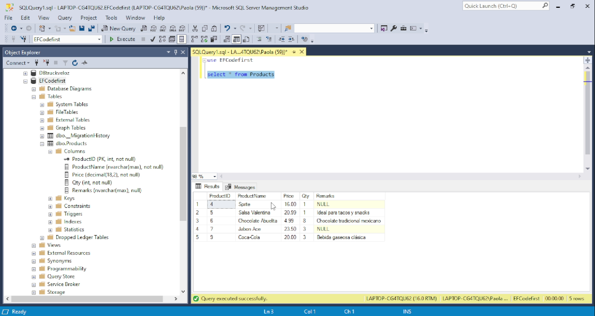

# .NET CRUD System
A continuación, se presenta una visualización del funcionamiento del proyecto. 
Las imágenes muestran las principales funcionalidades implementadas en el sistema CRUD desarrollado con .NET. 

